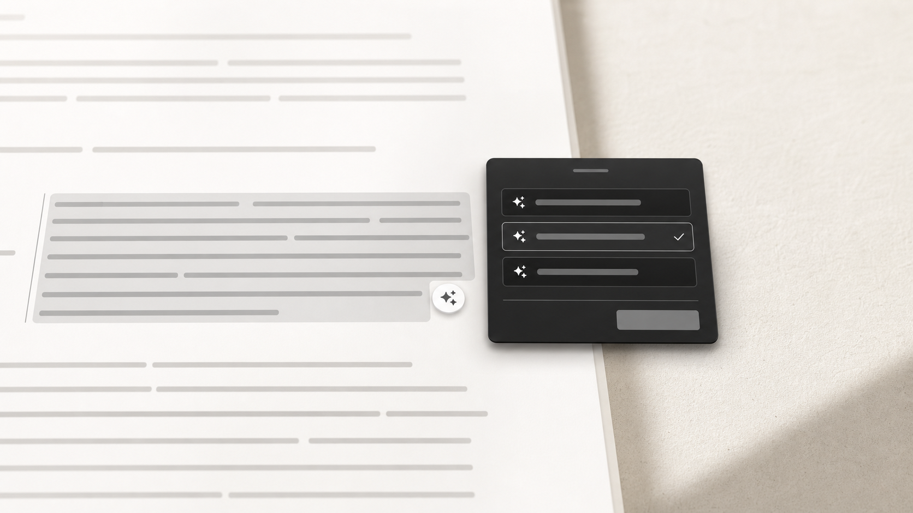

<div align="center">

# ✦ Cleanup

### Your words, finished.

Select rough text anywhere. Get better versions. Replace it without breaking your flow.

[](https://github.com/AbhiPoluri/cleanup-app/releases/latest)


[Download for Windows](https://github.com/AbhiPoluri/cleanup-app/releases/latest/download/CleanupSetup.exe) · [Install on macOS](#macos) · [See what it does](#one-utility-three-superpowers)

</div>


Cleanup is a native macOS menu bar and Windows tray app for the awkward gap between *what you meant* and *what you actually typed*. It works over the apps you already use—mail, chat, documents, browsers, and editors—so improving a sentence takes one shortcut, not a trip to another tab.

No prompt engineering. No copy-paste ritual. No new writing app to adopt.

## One utility, three superpowers

| ✦ Rewrite anywhere | ◫ Work with an agent | ◉ Think at the whiteboard |
|---|---|---|
| Highlight text and open Cleanup. Compare genuinely different rewrites, tune the one you like, then replace the original in place. | Give Codex or Claude a task, a screenshot, or selected context. Projects keep their own instructions, files, and resumable conversation. | Point a camera at a real whiteboard and brainstorm with an agent that can see it. Talk locally or continue from your iPhone. |

### Turn “good enough” into ready to send



Cleanup gives you up to five purposeful alternatives—not five lightly shuffled copies. Choose balanced, polished, compressed, fuller, or minimal-edit phrasing, then refine with natural instructions such as “shorter,” “less formal,” or “keep the joke.”

When speed matters, Instant Rewrite skips the chooser and replaces the selection automatically.

```text
Select → Trigger → Choose or refine → Replace
```

## Whiteboard ideas that do not disappear

Whiteboard mode turns a webcam and an optional phone into a lightweight thinking room:

- Frame the board with four draggable corners; Cleanup corrects the perspective before sending it to the agent.
- Ask the agent to “look” whenever the board changes and get a short, spoken-friendly response.
- Record locally with Parakeet transcription, with Windows speech as a fallback.
- Hear replies through the system voice or optional local Kokoro TTS.
- Scan the QR code to use an HTTPS iPhone remote for typing, hold-to-talk, photos, mute, and audio output.
- See the **Heard:** transcript as soon as Parakeet finishes, before the agent responds.
- Save longer sessions as Markdown inside the current project's `sessions` folder.

The Whiteboard agent follows the same provider and model selected in Agent Settings—including `gpt-5.5` when Codex is selected—and always runs with read-only permissions.

## Designed to stay out of the way

- **Native on both platforms.** Swift on macOS, WPF on Windows; system dark/light appearance and no browser shell.
- **Works where your text already lives.** Global shortcuts, a macOS Service, and optional Windows selection buttons.
- **Your choice of intelligence.** Use a ChatGPT/Codex login, Claude Code login, Ollama, or an OpenAI-compatible endpoint where supported.
- **Local voice is optional.** Parakeet ASR and Kokoro TTS run in a managed local environment after a one-time install.
- **Projects stay separate.** Each project gets its own working directory, brief, instructions, and resumable agent session.
- **Failure is visible.** The built-in health screen checks hotkeys, speech, local voice, CLIs, login state, and the active backend.

## Platform features

| Feature | macOS | Windows 10/11 |
|---|:---:|:---:|
| Rewrite selected text | ✓ | ✓ |
| Multiple variants and follow-up tuning | ✓ | ✓ |
| Instant auto-replace | ✓ | ✓ |
| Codex and Claude agent sessions | ✓ | ✓ |
| Project workspaces | ✓ | ✓ |
| Webcam Whiteboard | ✓ | ✓ |
| HTTPS iPhone remote and voice | ✓ | ✓ |
| Parakeet ASR and Kokoro TTS | ✓ | ✓ |
| Right-click Service | ✓ | — |
| Floating selection controls and Snip → Agent | — | ✓ |

## Install

### Windows

Download the latest self-contained installer—no separate .NET installation required:

### [Download CleanupSetup.exe →](https://github.com/AbhiPoluri/cleanup-app/releases/latest/download/CleanupSetup.exe)

The per-user installer does not require administrator access and can create Start Menu, desktop, and run-at-sign-in shortcuts.

To run from source instead, install the [.NET 8 SDK](https://dotnet.microsoft.com/download/dotnet/8.0):

```powershell
cd windows
dotnet run
```

Windows settings live at `%APPDATA%\Cleanup\settings.json`.

### macOS

Build and install the native app from source:

```bash
cd mac
bash build.sh install
```

On first launch, grant Accessibility permission so Cleanup can capture and replace selections. The install script places the app in `/Applications` and registers **Services → Clean Up Message**.

## Pick your engine

Rewrite and agent settings are intentionally separate, so a fast local model can handle routine rewrites while a stronger subscribed model handles agent and Whiteboard work.

| Engine | Best for | Setup |
|---|---|---|
| **Codex / ChatGPT login** | Rewrite, Agent, Whiteboard | Install the Codex CLI, run `codex login`, then select Codex in Settings. |
| **Claude Code login** | Rewrite, Agent, Whiteboard | Install Claude Code, sign in once, then select Claude in Settings. |
| **Ollama** | Private local rewrites | Install Ollama and pull a model such as `ollama pull llama3.2:3b`. |
| **OpenAI-compatible API** | Hosted rewrite endpoints | Enter the base URL, model, and API key in Settings. |

### Codex setup

```bash
npm install -g @openai/codex
codex login
```

Cleanup uses the CLI's existing login. Agent and Whiteboard model selection lives under **Settings → Agent**.

### Optional local voice

Open **Settings → Agent → Voice**, then choose **Install local voice engines**. Cleanup creates a managed Python environment for Parakeet ASR and Kokoro TTS. Models download once and are reused locally.

## Everyday controls

| Action | macOS | Windows |
|---|---|---|
| Open Cleanup on selected text | `⌃⌘E` | `Ctrl+Shift+E` |
| Instant rewrite | configurable | `Ctrl+Shift+R` |
| Select variant | `⌘1–5` | `Ctrl+1–5` |
| Regenerate | `⌘R` | `Ctrl+R` |
| Replace selection | `⌘↩` | `Ctrl+Enter` |
| Close | `Esc` | `Esc` |

## iPhone Whiteboard remote

1. Open **Whiteboard** from the menu bar or tray.
2. Select **phone** and scan the QR code.
3. Keep the computer and iPhone on the same Wi-Fi.
4. Accept Safari's one-time self-signed certificate warning and allow microphone access.
5. On Windows, allow Cleanup on private networks if the firewall prompt appears.

Remote sessions are protected by HTTPS and a random session token. The remote is intended for trusted local networks.

## Build a Windows release

Pushing a `v*` tag runs the GitHub Actions installer workflow, creates a self-contained `CleanupSetup.exe`, and attaches it to the corresponding GitHub Release.

```bash
git tag v1.4.0
git push origin v1.4.0
```

For a local publish:

```powershell
dotnet publish windows/Cleanup.csproj -c Release -r win-x64 --self-contained
```

## A few honest notes

- Cleanup needs Accessibility permission on macOS to read and replace selections.
- API keys entered directly are currently stored in the app settings file. Avoid doing this on shared machines.
- The iPhone remote uses a locally generated self-signed TLS certificate, so Safari shows a one-time warning.
- Local voice is optional and uses roughly 2 GB after its environment and models are installed.
- Product imagery above is art-directed; the exact interface varies slightly between macOS and Windows.

<div align="center">

### Spend less time rewriting. Keep the thought moving.

[Download the latest Windows release](https://github.com/AbhiPoluri/cleanup-app/releases/latest/download/CleanupSetup.exe) · [Browse releases](https://github.com/AbhiPoluri/cleanup-app/releases) · [Report an issue](https://github.com/AbhiPoluri/cleanup-app/issues)

</div>
